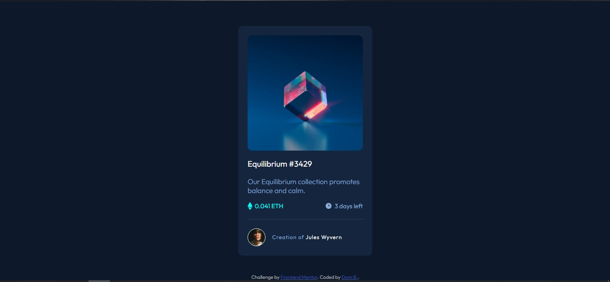

# Frontend Mentor - NFT preview card component solution

This is a solution to the [NFT preview card component challenge on Frontend Mentor](https://www.frontendmentor.io/challenges/nft-preview-card-component-SbdUL_w0U). Frontend Mentor challenges help you improve your coding skills by building realistic projects. 

## Table of contents

- [Overview](#overview)
  - [The challenge](#the-challenge)
  - [Screenshot](#screenshot)
  - [Links](#links)
- [My process](#my-process)
  - [Built with](#built-with)
  - [What I learned](#what-i-learned)
  - [Continued development](#continued-development)
  - [Useful resources](#useful-resources)
- [Author](#author)
- [Acknowledgments](#acknowledgments)

## Overview

### The challenge

Users should be able to:

- View the optimal layout depending on their device's screen size
- See hover states for interactive elements

### Screenshot




### Links

- [Github repo](https://github.com/dombrga/nft-preview-card)
- [Live site](https://dombrga.github.io/nft-preview-card/)

## My process

### Built with

- Semantic HTML5 markup
- CSS custom properties
- Flexbox

### What I learned

1. I did my best to follow the DRY (don't repeat yourself) principle. For example, I put the following CSS classes to elements
that I want to be block level.
```css
.block {
  display: block
}
.flex {
  display: flex
}
```
2. I was able to practice CSS float and overflow property.
3. I am still trying to make sense why this code centered the attribution. right=0 and left=0 centered the attribution div but I do not know why.
```css
.container {
  background-color: hsl(217, 54%, 11%);
  height: 100vh;

  flex-direction: column;
  justify-content: center;

  position: relative;
}

.attribution { 
  color: rgb(175, 176, 177);
  font-size: 11px; 
  text-align: center; 

  position: absolute;
  bottom: 0;
  right: 0;
  left: 0;
}
```
4. I learned how to use fonts from Google Fonts.

### Continued development

1. Position property.
2. Flexbox property.
3. Centering elements.
4. When to use inline-flex, inline-block.


### Useful resources

- [Flexbox Guide](https://css-tricks.com/snippets/css/a-guide-to-flexbox/) - Info all about flexbox.
- [Float property](https://stackoverflow.com/questions/9303976/how-do-i-align-two-span-elements-one-to-the-left-the-other-one-to-the-right) - This article helped me align 2 elements (one in right, other in left) in one line. (In 0.041 ETH and 3days left part)

## Author

- Website - [Dom B.](https://github.com/dombrga)
- Frontend Mentor - [@dombrga](https://www.frontendmentor.io/profile/dombrga)


## Acknowledgments

Thanks Frontend Mentor for this challenge.
